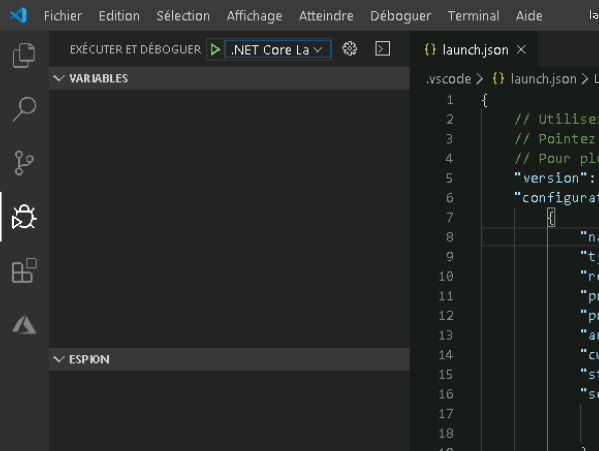
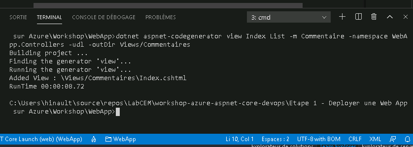
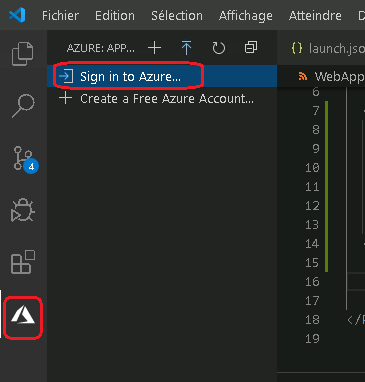
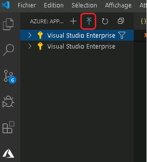
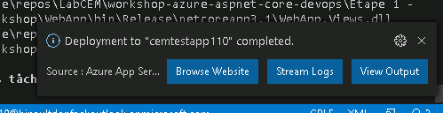

# <a name="create-an-aspnet-core-web-app-in-azure"></a>Créer et déployer une application web ASP.NET Core dans Azure Web Apps


[Azure App Service](https://docs.microsoft.com/fr-ca/azure/app-service/) vous permet de créer et d’héberger des applications web, des back-ends mobiles et des API RESTful 
dans le langage de programmation de votre choix sans gérer l’infrastructure. Il offre une mise à l’échelle automatique et une haute disponibilité, 
prend en charge à la fois Windows et Linux et permet des déploiements automatisés à partir de GitHub, Azure DevOps ou n’importe quel référentiel Git.

## <a name="goal"></a> Objectif

Pour cette première partie du laboratoire, les participants vont créer une application Web ASP.NET Core dans Visual Studio. Ils vont ajouter un formulaire pour collecter les commentaires
des utilisateurs. L'application sera ensuite déployée sur Azure App Service.

## <a name="prerequisites"></a>Prérequis

Pour effectuer ce laboratoire, vous devez installer :

- <a href="https://code.visualstudio.com/">Visual Studio Code</a>
- <a href="https://dotnet.microsoft.com/download/dotnet-core/3.1">Le SDK .NET Core 3.1</a>
- <a href="https://marketplace.visualstudio.com/items?itemName=ms-azuretools.vscode-azureappservice">L'extension Azure App Service</a>
- <a href="https://marketplace.visualstudio.com/items?itemName=ms-dotnettools.csharp">L'extension C# pour Visual Studio Code</a>

Vous devez également installer les outils **aspnet-codegenerator** et  **Entity Framework**. Pour cela, ouvrez l'invite de commande et exécutez la commande 

```
dotnet tool install -g dotnet-aspnet-codegenerator
```

et 

```
dotnet tool install -g dotnet-ef
```

## Cloner le dépôt

Pour commencer, vous devez cloner le dépôt Git du lab. 

Pour cela, créez un dossier LabCEM sur votre poste. Ouvrez l'invite de commande à partir de ce repertoire. Vous pouvez le faire en saisissant simplement **cmd** dans la zone de saisie du chemin du repertoire.

 
 
 Exécutez ensuite la commande suivante :

```
git clone https://github.com/hinault/workshop-azure-aspnet-core-devops-vscode.git
```
 
## <a name="open-website"></a> Ouvrir le projet de démarrage

Accedez au projet de démarrage en effectuant les étapes suivantes :

1. Ouvrez Visual Studio Code, puis sélectionnez **Fichier/Ouvrir le dossier**.

2. Selectionnez le dossier  (\Etape 1 - Deployer une Web App sur Azure\Workshop\WebApp).

3. Dans le menu de gauche, sélectionnez **Exécuter et déboguer**.

4. Cliquez ensuite sur l'icone verte à côté de **Exécuter et déboguer**



L'application de démarrage va s'afficher dans une fenêtre de votre navigateur.


## <a name="publish-y"></a>Modifier l'application Web


### Le modèle

Dans le dossier **Models**, ajoutez une nouvelle classe **Commentaire.cs**, avec le code suivant :

```cs
using System;


namespace WebApp.Models
{
    public class Commentaire
    {
        public int Id { get; set; }

        public string Nom { get; set; }

        public string Email { get; set; }
        
        public string Texte { get; set; }
        
        public DateTime DateCommentaire { get; set; }
    }
}

```
### Le contrôleur

1. Faites un clic droit sur le dossier Controllers. Sélectionnez **Nouveau Fichier**.

2. Donnez le nom **CommentairesController.cs** au fichier.

3. Remplacez le code dans ce fichier par ce qui suit :

```cs
using System;
using System.Collections.Generic;
using Microsoft.AspNetCore.Mvc;
using WebApp.Models;

namespace WebApp.Controllers
{
    public class CommentairesController : Controller
    {
        public IActionResult Index()
        {
            var commentaires = new List<Commentaire>()
            {
                new Commentaire(){Id=1,Nom="Thomas", Email="thomas@test.com", Texte="Belle initiative", DateCommentaire=DateTime.Now},
                new Commentaire(){Id=1,Nom="Daniel", Email="daniel@test.com", Texte="Intéressant pour découvrir Azure", DateCommentaire=DateTime.Now}
            };

            return View(commentaires);
        }
    }
}
```

### La vue

Nous allons utiliser le générateur ASP.NET pour générer la vue. Pour cela : 

1. Cliquez sur **Terminal** dans le menu, puis sur **Nouveau terminal**.

2. Cliquez sur la liste déroulante à droite dans la fenetre du terminal, déroulez et sélectionnez **cmd**. Si **cmd** n'existe pas dans la liste, cliquez sur **Sélectionner l'interpréteur de commandes par défaut**, puis sélectionnez **Command Prompt**

3. Exécutez la commade suivante :

```
dotnet aspnet-codegenerator view Index List -m Commentaire -namespace WebApp.Controllers -udl -outDir Views/Commentaires
```




Un fichier Index.cshtml sera ajouté dans le dossier 'Views/Commentaires'.

### Le layout

Ouvrez le fichier /Views/Shared/_Layout.cshtml.

Après les lignes de code :

```cs
<li class="nav-item">
                            <a class="nav-link text-dark" asp-area="" asp-controller="Home" asp-action="Index">Accueil</a>
                        </li>
```

Ajoutez le code suivant 

```cs
<li class="nav-item">
                            <a class="nav-link text-dark" asp-area="" asp-controller="Commentaires" asp-action="Index">Commentaires</a>
                        </li>
```

### Exécuter l'application

Appuyez F5 pour exécuter l'application.

## <a name="publish-your-web-app"></a>Déployer sur Azure

Le moyen le plus simple de déployer votre application est d'utiliser la fonction Web Deploy de Visual Studio Code.

1. Cliquez sur l'icone **d'Azure App Service** dans le menu de gauche.

2. Cliquez sur **Sign in to Azure**, pour vous authentifier avec votre compte Azure si cela n'a pas encore été fait.

   

3. Votre abonnement Azure va s'afficher. Cliquez sur le bouton **Deploy to Web App**.

   
   
4. Sélectionnez l'abonnement Azure.

5. Cliquez ensuite sur **Create new Web App... Advanced**.

6. Entrez le nom de la Web App. Vous devez donner un nom qui est unique.

7. Sélectionnez le groupe de ressources qui vous a été attribué. 

<a herf="https://docs.microsoft.com/fr-ca/azure/azure-resource-manager/management/overview#terminology">Un groupe de ressources</a> est un conteneur logique dans lequel les ressources Azure comme les applications web, les bases de données et les comptes de stockage sont déployés et gérés. Par exemple, vous pouvez choisir de supprimer le groupe de ressources complet ultérieurement en une seule étape.

8. Sélectionnez **Windows** pour l'OS de déploiement

9. Cliquez sur **Create new App Service plan**

<a href="https://docs.microsoft.com/fr-ca/azure/app-service/overview-hosting-plans">Un plan App Service</a> spécifie l’emplacement, la taille et les fonctionnalités de la batterie de serveurs web qui héberge votre application

10. Saisissez **MonPremierWebAppPlan** comme nom du plan de service

11. Sélectionnez **F1 Free** à l'étape suivante. Le [niveau tarifaire](https://azure.microsoft.com/pricing/details/app-service/?ref=microsoft.com&utm_source=microsoft.com&utm_medium=docs&utm_campaign=visualstudio) détermine les fonctionnalités d’hébergement.

12. À l'étappe Application Insight, cliquez sur **Skip for now**.

13. Pour finir, sélectionnez l'emplacement **Canada Central** pour leentre de données dans lequel l’application web est hébergée.

  
Une fois les ressources Azure créées, et le déploiment terminé, une notification va s'afficher. Cliquez sur **Browse WebSite**



Votre application exécutée dans Azure va s'afficher dans une fenêtre du navigateur.


Le nom d’application spécifié dans la page **Créer un App Service** est utilisé en tant que préfixe d’URL au format `http://<app_name>.azurewebsites.net`.

**Félicitations !** Votre application web ASP.NET Core s’exécute en temps réel dans Azure App Service.

## <a name="manage-the-azure-app"></a>Gérer l’application Azure

Pour gérer l’application web, accédez au [Portail Azure](https://portal.azure.com), puis cliquez sur **Groupes de ressources**


Dans la page **Groupes de ressources**, sélectionnez votre groupe de ressources.

Vous aurez deux ressources dans ce groupe, soit : le **Plan App Service** et **l'App Service**. 

Sélectionnez **L'App Service**.


Vous verrez la page Vue d’ensemble de votre application web. Ici, vous pouvez effectuer des tâches de gestion de base, par exemple parcourir, arrêter, démarrer, redémarrer et supprimer.


Le menu de gauche fournit différentes pages vous permettant de configurer votre application.

## FIN
